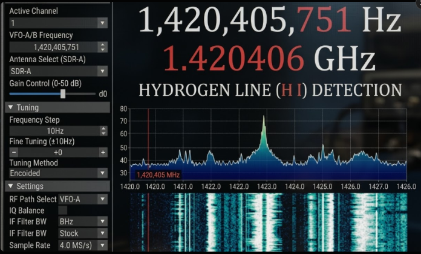
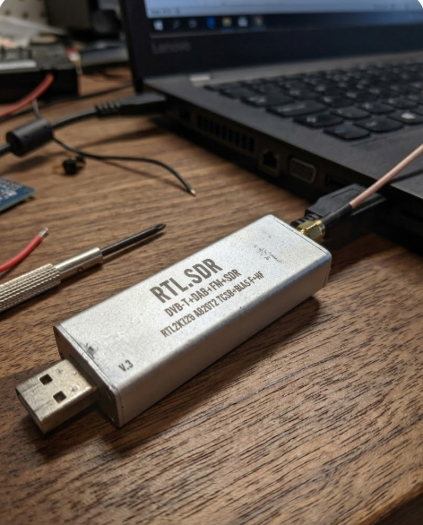

# HydrogenEye — Budget Radio Astronomy Receiver

A portable hydrogen line (H I, 1420.405 MHz) observation station built from a €13 RTL-SDR dongle. Designed as an entry point into radio astronomy without expensive equipment.



## Overview

This project transforms a cheap RTL-SDR V.3 receiver into a fully functional radio astronomy instrument capable of detecting the 21 cm hydrogen emission line — the most fundamental signal in radio astronomy, emitted by neutral hydrogen atoms across the galaxy.

The system runs on a Raspberry Pi Zero W with an Android companion app for real-time visualization and control over Wi-Fi.

## Hardware

| Component | Price (2023) |
|---|---|
| RTL-SDR Blog V.3 (R820T2 + TCXO) | €28 |
| Raspberry Pi Zero W | €15 |
| SMA cable + adapters | €7 |
| Power bank 10000 mAh | €12 |
| **Total** | **~€62** |



## Features

- **Real-time spectrum display** — waterfall + FFT at 1420 MHz band via Android app
- **Automatic H I peak detection** — alerts when hydrogen line signal exceeds noise floor threshold
- **Drift scan mode** — records radio sources as they pass through the antenna beam due to Earth's rotation
- **Signal integration** — long exposure stacking to pull weak signals out of noise (up to 60 min)
- **GPS-tagged recordings** — every observation stamped with coordinates and UTC time
- **One-tap calibration** — reference calibration against known radio sources (Cassiopeia A, Cygnus A)
- **CSV/FITS export** — raw spectral data export for analysis in Python, GNU Radio, or MATLAB
- **Night-vision UI** — deep red on black interface, zero eye strain during night observations

## Software Stack

- `Python 3` — signal processing, FFT, data pipeline
- `pyrtlsdr` — RTL-SDR device interface
- `NumPy / SciPy` — spectral analysis and integration
- `Flask` — lightweight API on Raspberry Pi
- `Kotlin` — Android companion app
- `WebSocket` — real-time data streaming to phone

## How It Works

```
RTL-SDR V.3 → Raspberry Pi Zero W → Wi-Fi → Android App
    ↓               ↓                          ↓
 1420 MHz       FFT + filter            spectrum display
 RF input       integration             peak detection
                CSV logging             drift scan plot
```

## Results

Successfully detected the hydrogen line at **1,420,405,751 Hz** with a signal-to-noise ratio of ~35 dB using the waveguide antenna and 30-second integration time.

## License

MIT
